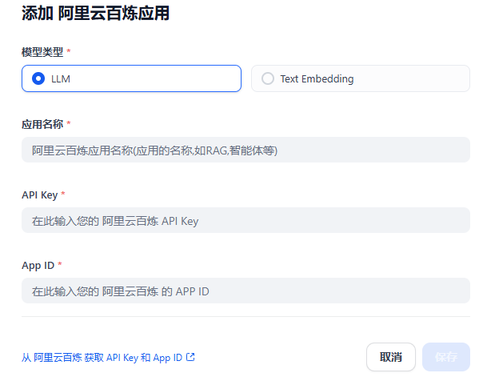

# Overview
 Dify 插件中已经存在的`通义千问`插件，可以让Dify使用阿里云提供的各种模型，以便构建丰富的LLM应用，这时，Dify只使用阿里云提供的模型，其他构建LLM应用所需的资源（如对话历史，向量数据库等），一般由Dify来提供。

然而，阿里云百炼平台也提供了构建LLM应用的能力，通过[阿里云百炼应用中心](https://bailian.console.aliyun.com/#/app-center), 可以构建各种类型的LLM应用，例如知识库，工作流和智能体应用。 在阿里云百炼上构建的LLM应用可以很容易关联上阿里云上的数据源(包括结构化数据库，非结构化数据库)，从而实现知识库问答，知识库工作流，知识库智能体应用等功能。在这种方式下，由于模型和数据都在阿里云上，不需要把托管在阿里云的数据读取到Dify，可以降低Dify的配置和维护的难度，同时避免Dify在本地处理数据的风险与延迟问题。 当然，这样方式的代价是失去了一些Dify提供的丰富功能和灵活性。

本插件允许Dify使用阿里云上已经构建好的云百炼应用，从而在使用云百炼应用的同时，还可以继续使用Dify所提供的功能，来构建更强大的LLM应用。简而言之，在Dify中使用本插件，既可以继续使用Dify的功能，还可以把云百炼应用集成到Dify中。

# 使用本插件的优势
✅ **无缝桥接非OpenAI兼容的API**  
- 阿里云百炼应用构建的API **不兼容OpenAI规范**，此插件实现`阿里云百炼应用`与`Dify`的集成，无需改造现有百炼应用。  

✅ **保留Dify功能的同时复用阿里云能力**  
- 利用`Dify`的UI交互、Prompt工程和API管理功能，同时通过本插件调用已构建的百炼应用（如知识库问答、工作流），**无需在Dify中重新配置数据库或知识库**。  

✅ **免除复杂基础设施维护**  
- 数据存储、向量化、模型推理等均由阿里云托管，Dify仅作为交互层和智能体层，**避免维护数据库、向量数据库等复杂组件**。  

✅ **数据安全与合规性**  
- 数据全程保留在阿里云环境，插件仅透传输入与响应，**无本地数据缓存或二次存储风险**。  

✅ **开发效率提升**  
- 复用阿里云百炼应用中心已配置的LLM应用（如客服机器人、文档分析），**避免在Dify中重复开发相同逻辑**，缩短上线周期。  

# 使用本插件需要注意的点
- 需先自行在阿里云百炼应用中心创建应用(还可以给应用配置好数据源，配置工作流和智能体)
- Dify的日志系统无法直接追踪百炼API内部状态（如向量检索耗时、模型分片负载）

# 配置
在Dify上安装完成本插件后，您需要：
1. 从[阿里云百炼平台](https://bailian.console.aliyun.com/?apiKey=1#/api-key)获取API密钥，并在 **设置 -> 模型提供商** 中进行配置。
2. 如果您尚未创建LLM应用，请前往[阿里云应用中心](https://bailian.console.aliyun.com/#/app-center)构建自己的LLM应用。
3. 每个LLM应用都有一个App ID（应用ID），该ID可从[阿里云应用中心](https://bailian.console.aliyun.com/#/app-center)获取（App ID通常是一个由32个字符组成的字符串，例如 `65ce7884f97fd4365471e76989ea1111`）。

# 联系作者
tianhe.li@outlook.com

